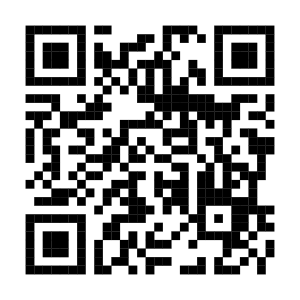

# {-}


```{r qr,  echo=FALSE, warning=FALSE}
library(qrcode)

qr <- qr_code('https://janvoss.github.io/Science_Lab')
#plot(qr)

generate_svg(qr, filename = "qr-titel.svg")

```


 ${}$             |  Unterlagen: https://janvoss.github.io/Science_Lab
:-------------------------:|:-------------------------:
  |  {width=40% }


# Was wird erarbeitet?

<style>body {text-align: justify}</style>

Das Science Lab steht in diesem Semester unter der Überschrift
**Neubelebung der Industriepolitik**. Als Prüfungsleistungen schreiben Sie
in Dreierteams (zur Not: allein) eine kurze **wissenschaftliche
Ausarbeitung** und absolvieren Sie eine **mündliche Prüfung**.

Grundlage Ihrer Seminararbeit sind die Beiträge aus dem Zeitgespräch in
der Zeitschrift [Wirtschaftsdienst](https://www.wirtschaftsdienst.eu/inhalt/jahr/2025/heft/8/beitrag/neubelebung-der-industriepolitik.html)
zum oben genannten Thema:

[Anpassen]::

...


In Ihrer Seminararbeit setzen Sie sich mit mindestens vier der Texte aus
dem Wirtschaftsdienst auseinander. Als zusätzliche Literatur
recherchieren und verarbeiten Sie bitte mindestens *drei zusätzliche
wissenschaftliche Texte nach eigener Wahl, wobei mindestens ein Text auf Englisch sein
muss*. Merkmale wissenschaftlicher Texte werden wir im Seminar
besprechen.

In Ihrer Seminararbeit stellen Sie die Argumente ausgewählter Positionen
dar und setzen sie zueinander in Beziehung. Die von Ihnen ausgewählten
Aspekte des Themas sollten durch eine gemeinsame &bdquo;gedankliche Klammer&ldquo;
miteinander verbunden sein, die Sie in Ihrer Seminararbeit einleitend
darstellen.

In der mündlichen Prüfung zu diesem Seminar werden Grundlagen der
Wissenschaftstheorie, Prinzipien des wissenschaftlichen Arbeitens sowie
ausgewählte Inhalte aus dem Themenbereich des Seminars geprüft. Die
mündliche Prüfung bezieht sich *nicht* auf Ihre Seminararbeit.


# Warum?

-   Sie bekommen einen Einblick in **aktuelle praxisrelevante und methodische Fragen der ökonomischen Analyse**.

-   Sie erlernen **Grundlagen des wissenschaftlichen Arbeitens**, insb.
    Schreibens.

-   Sie erlernen den wissenschaftlichen Umgang mit **Literatur**.

-   Sie **arbeiten sich selbstständig** in ein Thema **ein**.

- Sie üben **Teamarbeit**.

# Bis wann?

Abgabe aller Unterlagen bis zum *9. Januar 2026*  bitte in elektronischer Form im Portable Document Format (pdf) über den **Uploadordner für Seminararbeiten** in neo. *Bitte benennen Sie unbedingt Ihre Datei in dem Format &bdquo;Nachname.pdf&ldquo;.*

Wer sich für die Verwendung von $\LaTeX$ entscheidet, erhält drei
zusätzliche Tage Bearbeitungszeit.

Beachten Sie die Regeln und Tipps zum wissenschaftlichen Arbeiten.
Fragen Sie bei Bedarf!

# Worum geht es ?

```{r}

8library(knitr)

# Erstelle den Data Frame
industriepolitik <- data.frame(
  Merkmal = c(
    "Zielgruppe",
    "Ansatz",
    "Beispiele",
    "Vorteile",
    "Risiken",
    "Politische Akzeptanz"
  ),
  Horizontale_Industriepolitik = c(
    "Gesamte Wirtschaft/Industrie",
    "Allgemeine Rahmenbedingungen verbessern",
    "Infrastruktur, Bildung, Forschung, Steueranreize",
    "Wettbewerb bleibt erhalten, geringe Verzerrungen",
    "Weniger gezielte Steuerung, ggf. langsamer Wandel",
    "Breiter Konsens, marktkonform"
  ),
  Vertikale_Industriepolitik = c(
    "Einzelne Sektoren, Branchen oder Unternehmen",
    "Selektive Förderung strategischer Bereiche",
    "Subventionen für Batterien, Stahl, E-Mobilität",
    "Schnelle Entwicklung strategischer Industrien",
    "Wettbewerbsverzerrung, Risiko von Fehlallokation",
    "Umstritten, Gefahr von Lobbyismus"
  )
)

# Gib die Tabelle mit kable aus
kable(industriepolitik, 
      col.names = c("Merkmal", "Horizontale Industriepolitik", "Vertikale Industriepolitik"),
      caption = "Vergleich: Horizontale vs. vertikale Industriepolitik")

```

# Ihre Seminararbeit

<style>body {text-align: justify}</style>


Das Erstellen einer wissenschaftlichen Arbeit erfordert die Beachtung
zahlreicher Vorgaben sowie ein planvolles Vorgehen. Sie müssen sich
systematisch in eine neue Materie einarbeiten, ohne dass Sie im Vorfeld
den Zeitaufwand der jeweiligen Arbeitsschritte genau kennen können.
Diese Hinweise sollen Ihnen die Arbeit etwas erleichtern.

## Umfang Ihrer Seminararbeit

Bitte beachten Sie in Ihrer Arbeit (von Dreierteams erstellt) die Zeichenrestriktion von
*12.000-15.000 Zeichen*, *inklusive Leerzeichen*.

## Struktur Ihrer Seminararbeit

Ihre Seminararbeit muss eine bestimmte Struktur aufweisen. Wesentliche
Elemente sind: Deckblatt, Verzeichnisse, Einleitung, Hauptteil, Fazit,
Literaturverzeichnis sowie ggf. Anhänge. Über Anforderungen an diese
Elemente werden wir im Seminar sprechen.

[Hier Übersicht]::

## Wissenschaftliches Schreiben

Das Ziel des wissenschaftlichen Schreibens besteht in der Präsentation
einer eigenständigen wissenschaftlichen Leistung. Der Grad der
Eigenständigkeit kann variieren. Im ersten Semester verlange ich von
Ihnen lediglich die eigenständige Verarbeitung fremder Gedanken. Dies
klingt einfacher als es ist. Spätere wissenschaftliche Texte von Ihnen
werden höheren Ansprüchen an die Eigenständigkeit genügen müssen.

Ein wesentliches Kriterium für einen wissenschaftlichen Schreibstil ist
die Nachvollziehbarkeit der Gedankenführung. Hierfür sollte die Sprache
möglichst klar sein. Ihre Schlussfolgerungen müssen auf
nachvollziehbaren Argumenten beruhen.

Eine Voraussetzung für die Präsentation einer wissenschaftlichen Arbeit
besteht in der Einhaltung bestimmter &bdquo;Spielregeln&ldquo; des
wissenschaftlichen Schreibens. Eine der wichtigsten Regeln besteht
darin, dass immer deutlich werden muss, wenn Sie einen Gedanken nicht
selbst entwickelt, sondern aus einem anderen Text übernommen haben. Dies
werden wir im Seminar ausführlich besprechen.

Ihre Seminararbeit muss den Kriterien wissenschaftlichen Schreibens
genügen. Fügen Sie deshalb auch ein Literaturverzeichnis an. Zahlreiche
wertvolle Hinweise und Hilfestellungen zum wissenschaftlichen Schreiben
finden Sie in Büchern zum wissenschaftlichen Arbeiten wie z. B.
@Oehlrich15 oder @Berger-Grabner2016.

Darüber hinaus verlangt das Erstellen einer Seminararbeit bestimmte
handwerkliche Fähigkeiten der Texterstellung.

## Äußere Form Ihres Textes

Ein gut lesbarer Text sollte fehlerfrei sein. Gegenüber eigenen Texten
wird man mit der Zeit &bdquo;betriebsblind&ldquo;. Daher empfiehlt es sich, für die
Endredaktion KorrekturleserInnen einzusetzen, die den Text nach
Möglichkeit noch nicht kennen. Geben Sie den KorrekturleserInnen Zeit!

Der Leser, die Leserin möchte und sollte sich auf den Inhalt Ihres
Textes konzentrieren. Daraus folgt allerdings gerade nicht, dass die
äußere Form belanglos wäre -- im Gegenteil: Je weniger die äußere Form
als &bdquo;störend&ldquo; empfunden wird, desto besser gelingt die Konzentration
auf das Wesentliche, den Inhalt. Daher sollte das Layout des Textes
übersichtlich und schlicht sein, sodass der Leser sich auf den Inhalt
des Textes gut konzentrieren kann.

Ich empfehle eine Schriftgröße von 11 oder 12 Punkten, 1,5-fachen
Zeilenabstand und Blocksatz (mit Silbentrennung). Zur guten Lesbarkeit
verwenden Sie bitte eine Serifenschrift (z. B. Times New Roman,
Linux Libertine oder Liberation Serif).

## Nutzung von Hard- und Software

### Software zur Texterstellung

Ein wissenschaftlicher Text entsteht typischerweise nicht (nur) mit
Stift und Papier, sondern unter Nutzung von Hard- und Software. Um
einen wissenschaftlichen Text verfassen zu können, muss man mit der
verwendeten Hard- und Software hinreichend vertraut sein. Dies
betrifft z.B. die Umsetzung von Formatierungsvorgaben mit einem
Textverarbeitungsprogramm, die Erstellung von Verzeichnissen usw.

Erfahrungsgemäß nutzen viele Studierende eine Version von Microsoft Word
oder von LibreOffice.

Erwägen Sie aber durchaus auch die Nutzung von  $\LaTeX$. Die Nutzung von
$\LaTeX$ erlaubt das Erstellen sehr professionell formatierter
strukturierter Texte und unterstützt eine sehr gute Darstellung
mathematischer Ausdrücke.^[ $\LaTeX$-Dokumente sind reine Textdokumente,
die neben dem inhaltlichen Text auch Formatierungsanweisungen enthalten.
Das Programm $\TeX$ bzw. pdf$\TeX$ erstellt daraus dann eine Druckvorlage,
etwa im Format portable document format (pdf).]

Die Verwendung von $\LaTeX$ erfordert eine Installation des jeweiligen
Programms und zahlreicher Pakete, die etwas lästig sein kann. Der
online-Service [Overleaf.com](http://www.overleaf.com) ermöglicht die
Nutzung von $\LaTeX$ ohne Installation von $\TeX$ und Pflege der $\LaTeX$-Pakete.
Sie brauchen dazu lediglich einen Webbrowser. Sie schreiben in einem
übersichtlichen Editorfenster. Ihr Quelltext wird dann in ein
pdf-Dokument kompiliert. Dieser Prozess stellt eine sehr einfache Form
der Nutzung von $\LaTeX$ dar.

Wenn Sie im Team arbeiten, sollten Sie sich hinsichtlich der Nutzung
eines Textverarbeitungsprogramms abstimmen. Auch unterschiedliche
Versionen des gleichen Programms können erfahrungsgemäß beim
Zusammenfügen von Dokumententeilen zu Problemen führen.

### Software zur Literaturverwaltung

Für die Verwaltung bibliografischer Angaben gibt es zahlreiche
Programme, die auch direkt mit Ihrem Textverarbeitungsprogramm
interagieren können. Zu nennen wären etwa Citavi, Zotero oder Mendeley. Für das Erstellen einer kurzen Arbeit übersteigt der Aufwand der Einarbeitung
vermutlich den praktischen Nutzen. Für spätere wissenschaftliche
Arbeiten ist die Nutzung solcher Programme vermutlich aber sehr
hilfreich.^[Dieser Text wurde unter Nutzung von BibTex und Zotero erstellt.]

## Nutzung von KI-gestützten Diensten

- Im Bereich der künstlichen Intelligenz  (KI) erfreuen sich Dienste auf der Basis von
generative pre-trained transformers einer zunehmenden Beliebtheit. 

- Beispiele: Chat GPT, Microsoft Copilot, Google  Gemini, Perplexity, Deep Seek, $\dots$

- Diese Dienste können in menschlicher Sprache mit NutzerInnen interagieren

- Sie verfügen über eine hohe Sprachkompetenz. Die inhaltliche Kompetenz ist von außen schwer einzuschätzen

- Subjektiver Eindruck: Die Kompetenz entspricht der eines Gesprächspartners mit guter Allgemeinenbildung, aber ohne fachlich vertiefte Kenntnis 

- Inzwischen hohe Recherchekompetenz zumindest bei Themen, deren Nische nicht zu eng ist und über die es qualitativ hochwertige Texte frei verfügbar über das Internet gibt.

- Problem: In der Regel kein (transparenter) Zugang zu kostenpflichtigen Fachartikeln und damit zu relevanten Teilen der aktuellen Literatur.

- Generelle Haltung: Dienst ist ein beflissener Assistent, sagt aber nicht, wenn er etwas nicht weiß. 


### Liefern die Dienste Wissen?

- Wissensbegiff (s.u.): [Definition wissenschaftliches Wissen im Science_Lab](https://janvoss.github.io/Science_Lab/wissenschaftstheorie.html#anforderungen-an-wissenschaftliches-wissen)

- Die Antworten von KI-gestützten Diensten sind  
  - inzwischen oft nachvollziehbar begründet und belegt (insbeondere bei Anfragen mit sogenanntem tiefem Nachdenken und Onlinerecherche)
  - aber immer wieder nicht irritationsfest
  
- Die Dienste haben schlicht keine Idee von einer Wirklichkeit, zu der ihre Antworten in einem (möglichst wahren) Bezug stehen sollten. 

- Die Dienste "überlegen" nicht, wenn sie eine Antwort suchen. Sie verwenden Algorithmen, die ihnen sagen, welche Antworten mit hoher Wahrscheinlichkeit "gute" Antworten sind. Das müssen nicht "wahre" Antworten sein.

- Eigentlich halluzinieren die Dienst die ganze Zeit: Sie sprechen ohne Bewusstsein. 

- Dennoch können Sie sehr hilfreich sein.


<blockquote class="twitter-tweet" data-dnt="true"><p lang="en" dir="ltr">If all we had was ChatGPT, we could say, hmm “maybe hallucinations are just a bug”, and fantasize that they weren’t hard to fix.<br><br>If all we had was Gemini, we could say, hmm “maybe hallucinations are just a bug”.<br><br>If all we had was Mistral, we could say, hmm “maybe hallucinations…</p>&mdash; Gary Marcus (@GaryMarcus) <a href="https://twitter.com/GaryMarcus/status/1781769926279409857?ref_src=twsrc%5Etfw">April 20, 2024</a></blockquote> <script async src="https://platform.twitter.com/widgets.js" charset="utf-8"></script>

### KI-gestützte Dienste als Schummelsoftware

- Komplette Arbeit schreiben


- Schlechte Idee! (Aber inzwischen nicht mehr *so* schlecht)

  - Halluzinieren i.e.S.

  - keine Inhaltliche Kompetenz des Dienstes (und der/des Studierenden?)

  - evtl. geringe Nachvollziehbarkeit der faktischenGrundlage
  
  - evtll. Probleme bei der Erfüllung formaler Kriterien.

  - Prüfungstechnisch: Kein eigener Wissenserwerb $\rightarrow$ Täuschungsversuch


### KI-gestützte Dienste als Recherchedienst

- Das gelingt immer besser, aber auch hier nicht immer ein gemeinsames Verständnis vom Thema bzw. der Aufgabe

- Durchaus beachtliche Wahrscheinlichkeit von inhaltlichen Fehlern oder aber bestimmten inhaltlichen Gewichtungen, die Sie nicht für richtig halten müssen.

- Die inhaltliche Bewertung der Rechercheleistung müssen *Sie* leisten. Das kann Ihnen der Dienst nicht abnehmen.

- Eher Gesprächspartner als Orakel

- *Kein* umfassender Zugriff auf wissenschaftliche Literatur 

### Konzeptionelle Unterstützung

- Fragestellungen diskutieren

- Vorschläge für wichtige Aspekte geben lassen

- Ideen "gemeinsam" reflektieren

- Gliederung erstellen und verfeinern lassen 

- Gliederung zur Diskussion stellen

- Mathematische Konzepte erklären lassen

- $\dots$


### Redaktionelle Unterstützung

- Fehlerkorrektur

- Formulierungshilfen

### Literatur auswerten

- Einige Dienste erlauben das Hochladen und Auswerten von pdf-Dokumenten und können Zusammenfassungen erstellen und Fragen beantworten 

- Das kann für einen Überblick sehr interessant sein, es ersetzt typischerweise aber nicht das Lesen der Texte, die Sie tatsächlich verwenden möchten.

- Interessant: Auch Videos könnne teilweise zusammengefasst/ausgewertet werden.

### Schreiben von Code

- Große Unterstützung bei der Erstellung von Code in gängigen Sprachen

- Neben den genannten Diensten etwa github Copilot oder Rtutor.ai

### Genereller Nutzungshinweis

- Präzise Formulierung der Aufgabenstellung (prompt) erhöht die inhaltliche Qualität der Antworten.

- Dazu gehören u.U. auch Angaben über den Kontext und den gewünschten Sprachstil

- Kommunikation mit Dienst als Gespräch sehen.  Nicht unbedingt mit der ersten Antwort zufrieden geben, sondern weiter damit arbeiten

- Geben Sie nicht die inhaltliche Verantwortung an den KI-gestützten Dienst ab. Die Dienste sollen sie nicht schlauer machen/erscheinen lassen sondern produktiver machen!

- Dienste für Literaturrecherche und -auswertung wie [Consensus](https://consensus.app) und [Elicit](https://elicit.com)  sind eher noch (!?) experimentell


### Zusammenfassung

<iframe src="https://www.linkedin.com/embed/feed/update/urn:li:share:7312865778536505344?collapsed=1" height="399" width="504" frameborder="0" allowfullscreen="" title="Eingebetteter Beitrag"></iframe>

# Einarbeiten in die Materie: Literaturrecherche und -auswertung

<style>body {text-align: justify}</style>

## Grundsätzliches
Sie müssen sich mit einer für sie noch nicht vertrauten Materie
auseinandersetzen. Dies erfordert, dass Sie erkennen, welche
Informationen Sie benötigen. Im nächsten Schritt müssen Sie sich
überlegen, wie Sie sie erhalten können.

Die Literaturrecherche erfordert Übung und Geduld. Passende Literatur
über ein Thema zu finden, mit dem man sich noch nicht gut auskennt, ist
immer eine Herausforderung. Auch besteht die Gefahr, dass man sich
&bdquo;verzettelt&ldquo; und viel Zeit für wenig geeignete Texte aufwendet. Für
dieses Seminar habe ich Ihnen umfangreiche Startliteratur vorausgewählt.

## Fundstellen für wirtschaftswissenschaftliche Artikel

Fachartikel im Bereich VWL erscheinen typischerweise in
wissenschaftlichen Zeitschriften. Hiervon gibt es insb. im
englischsprachigen Bereich inzwischen unzählige, die sich hinsichtlich
ihrer inhaltlichen Schwerpunkte, der Qualitätsansprüche an Artikel,
ihrer Reputation sowie der Lesbarkeit gerade für AnfängerInnen stark
unterscheiden.

Für den Einstieg empfinden Sie vielleicht die folgenden Zeitschriften
als hilfreich:

-   **Deutschsprachige Zeitschriften**

    -   [Aus Politik und Zeitgeschichte](https://www.bpb.de/shop/zeitschriften/apuz/) ^[Hierbei handelt es sich nicht um eine wirtschaftswissenschaftliche
    Fachzeitschrift i. e. S. Aber es werden mitunter
    wirtschaftswissenschaftlich relevante Themen behandelt.]

    -   [List Forum für Wirtschafts- und Finanzpolitik](https://link.springer.com/journal/41025/volumes-and-issues)

    -   [Perspektiven der Wirtschaftspolitik](https://www.degruyter.com/journal/key/pwp/html?lang=de#issues)

    -   [Wirtschaftsdienst](https://www.wirtschaftsdienst.eu/)

    -   [Zeitschrift für Wirtschaftspolitik](https://www.degruyter.com/journal/key/zfwp/html?lang=de)

-   **Englischsprachige Zeitschriften**

    -   [Intereconomics](https://www.intereconomics.eu/)

    -   [Journal of Economic Literature](https://www.aeaweb.org/journals/JEL)

    -   [Journal of Economic Perspectives](https://www.aeaweb.org/journals/jep)

    -   [Journal of Economic Surveys](https://onlinelibrary.wiley.com/journal/14676419).

Darüber hinaus sind z.B. die Gutachten des Sachverständigenrates zur
Begutachtung der gesamtwirtschaftlichen Lage oder die Monatsberichte der
Bundesbank für einige Themen hilfreiche Fundstellen.


## Suchportale

Suchportale können die Suche nach Literatur erheblich erleichtern. Hier
seien beispielhaft nur einige genannt:

-   [EconLit](https://dbis.uni-regensburg.de/warpto.php?bib_id=hfwu&color=2&titel_id=6926&url=http%3A%2F%2Fwww.redi-bw.de%2Fdb%2Fstart.php%3Fdatabase%3DEconLit-FT-ebsco),
    ein sehr umfangreiches Suchportal insbesondere für ökonomische Texte

-   [EconBiz](https://www.econbiz.de), ein Suchportal der Zentralbibliothek für
    Wirtschaftswissenschaften (ZBW) in Kiel

-   [Google Scholar](http://scholar.google.de), das Suchportal für wissenschaftliche
    Veröffentlichungen von Google

-   [Mendeley](https://www.mendeley.com), ein
    Literaturverwaltungsprogramm mit online-Suchfunktion, das zum Verlag
    Elsevier gehört. Um Mendeley nutzen zu können, muss man ein
    (gebührenfreies) Nutzerkonto einrichten.
    
-   [Semantic Scholar](https://www.semanticscholar.org/), KI-gestütztes Rechercheportal für wissenschaftliche Texte  

Alle diese Portale weisen verschiedene Vor- und Nachteile auf.^[Gerade bei den letzten beiden Portalen sollten Nutzer sich bewusst sein, dass sie Daten preisgeben, die kommerziell genutzt werden könnten.] Den besten Überblick verschafft man sich durch Ausprobieren.

## Zugang zu Literatur

Wissenschaftliche Fachzeitschriften erscheinen neben der gedruckten Form
v. a. in elektronischer Form. Teile sind gelegentlich frei zugänglich,
der größte Teil ist allerdings kostenpflichtig. Über die
Hochschulbibliothek haben Sie Zugang zu einem großen Teil des
elektronischen Angebots der wirtschaftswissenschaftlichen
Fachzeitschriften.^[Der nicht-autorisierte Zugriff auf Fachliteratur aus eigentlich  kostenpflichtigen Fachzeitschriften erfreut sich allerdings offenbar immer größerer Beliebtheit
    [@Bohannon2016; @McKenzie2017; @Himmelstein2017; @Bjork2017].] Viele Fachbücher erscheinen ebenfalls in
elektronischer Form. Auch auf viele Fachbücher in elektronischer Form
haben Sie über die Bibliothek Zugriff. Für den physischen Zugriff auf
(gedruckte) Bücher lohnt sich ein Blick in den Bestand der
Hochschulbibliothek. Bei Nichtvorhandensein besteht grundsätzlich die
Möglichkeit zu einer Fernleihe.

# Wissenschaftstheorie

<style>body {text-align: justify}</style>


Die Prinzipien des wissenschaftlichen Arbeitens leiten sich aus
bestimmten Vorstellungen über Wissen sowie über Wahrheit ab. Ein
Verständnis dieser Begriffe hat über den Wissenschaftsbetrieb hinaus
Bedeutung, da dies auch die Grundlagen eines gesellschafltichen
Diskurses berührt.

Im Seminar werden Grundlagen der Wissenschaftstheorie insbesondere
basierend auf @ElKassar21, @Kolmer17 und @Weingart2017 besprochen.

## Wissensbegriffe

- Phänomenales Wissen

  Unmittelbare Sinneseindrücke (Schmerz, Wärme, Kälte, ...)

- Praktisches Wissen

  - Die Fähigkeit, bestimmte Tätigkeiten auszuführen, evtl. ohne die Fähigkeit zu erklären, wie es geht
  
  - Fahrradfahren, Technike des Sports, ein Instrument spielen...
  
  - Keith Richards: "I know I can do it, but I don't know *how* I do it."
  
  <blockquote class="twitter-tweet" data-media-max-width="560" data-dnt="true"><p lang="en" dir="ltr">81-year-old Keith Richards proving he still rocks <a href="https://t.co/OOeBcW4oCK">pic.twitter.com/OOeBcW4oCK</a></p>&mdash; 🎸 Rock History 🎸 (@historyrock_) <a href="https://twitter.com/historyrock_/status/1912174076506022286?ref_src=twsrc%5Etfw">April 15, 2025</a></blockquote> <script async src="https://platform.twitter.com/widgets.js" charset="utf-8"></script>

- **Satzförmiges Wissen**

  - Über Sprache vermittelbares Wissen
  
  - Kann abstrakte Sachverhalte beinhalten

## Anforderungen an (wissenschaftliches) Wissen

### Wissen als wahre begründete Meinung

- Wissenschaftliches **Wissen ist wahre, begründete Meinung** [@Detel08_GK_Philosophie4; @ElKassar21] 
  - Nur *wahre* Meinung?  Die Wahrheit von Aussagen ist nicht immer beweisbar (Formalwissenschaften vs. empirische Wissenschaften)
    \(\rightarrow\) Wahrheit gegenwärtig plausibel
    \(\rightarrow\) Wissen ist nicht Gewissheit
    
- Weitere Anforderungen  [@ElKassar21]  

  - Die **Begründung**/Rechtfertigung **genügt bestimmten Ansprüchen**. 
    - Begründung ist **intersubjektiv überprüfbar**/ wird in **logisch geordneter Form** präsentiert (oder kann zumindest so präsentiert werden )  
    - Begründung ist in einen **nachvollziehbaren Begründungszusammenhang** eingebettet. Die dem Wissen zugrundeliegende Rechtertigungskette gehört zum Wissen.   
  \(\rightarrow\) **Wissenschaftliches Wissen existiert innerhalb von  Zusammenhängen**  
  \(\rightarrow\) Wissenschaftliches Wissen bezieht sich i.d.R. nicht auf singuläre Tatsachen sondern **allgemeine Zusammenhänge**.
  - Wissen ist **irrtumssensibel**, es *könnte* also falsch sein und durch gerechtfertigte Kritik widerlegbar/anzweifelbar sein
  - Wissen ist **irritationsfest**, die Überzeugung, dass es wahr ist, hält auch (zumindest zunächst) Einwänden stand.

### Wissen als rationale Behauptung

[Ist das nicht eher eine Frage der Wahrheit?]::

- Eine Behauptung beinhaltet dem Anspruch, dass eine andere Person der Behauptung zustimmen kann.

- Eine **rationale Behauptung** macht ihre Beziehung zu den Gründen, aus denen sie ihren Anspruch auf Zustimmung ableitet, sichtbar und legt sie zur Überprüfung offen (s. auch unten die Philosophische Happy Hour zur Wahrheit).

- Durch die Offenlegung kann über die Gründe konstruktiv diskutiert werden. 

(Die philosophische Frage nach der Feststellbarkeit der Wahrheit einer Aussagen lässt sich umgehen, indem man sich auf die offengelegten Gründe konzentriert )

### Die Bedeutung des Wissensbegriffes für den Wissenschaftsbetrieb

- Derartiges Wissen oder derartige Behauptungen bestehen nicht zwingend nur aus wahren Aussagen (Irrtum kann immer noch entdeckt werden)

- Aber eine Person, die diese Ansprüche gelten lässt, kann einfordern im Diskurs ernst genommen zu werden

- Ernsthaft kann man über dieses Wissen nicht beliebig reden. (Konkurrierende) Positionen zu diesem Wissen können ihrerseits nur Geltung einfordern, wenn sie sich diesen Ansprüchen stellen

## Psychologie des Wissens: Kontakt mit dem Unwissen

```{r, eval=F, echo=FALSE}
## Code erzeugt und speichert das gewünschte Video, führt aber in einen Error.

## Workaround: Einmal laufen lassen, um Video zu erzeugen, dann auf eval=F setzen, damit Error umgangen wird, und Seite weiter erzeugen

# Install and load necessary libraries
# install.packages("ggplot2")
# install.packages("gganimate")
# install.packages("ggforce")
# install.packages("av")  # Für Video-Export
library(ggplot2)
library(gganimate)
library(ggforce)
library(av)  # Für Video-Export
library(dplyr)

# Define parameters
max_radius <- 1
circle_center_x <- 0
circle_center_y <- 0

# Create data for animation
animation_data <- data.frame(
  frame = 1:100,
  radius = seq(0.01, max_radius, length.out = 100)
)

# Create the plot
p <- ggplot() +
  # Schwarzer Hintergrund für den gesamten Plot
  theme_void() +
  theme(plot.background = element_rect(fill = "black", color = NA)) +
  
  # Schwarzes Rechteck als Hintergrund
  annotate("rect", 
           xmin = -max_radius*1.2, 
           xmax = max_radius*1.2, 
           ymin = -max_radius*1.2, 
           ymax = max_radius*1.2, 
           fill = "black") +
  
  # Weißer Kreis mit präzisen Grenzen
  geom_circle(data = animation_data,
              aes(x0 = circle_center_x, 
                  y0 = circle_center_y, 
                  r = radius),
              fill = "white",
              color = NA) +
  
  # "Wissen" Text
  geom_text(aes(x = 0, y = 0, label = "Wissen"),
            color = "black",
            size = 6) +
  
  # "Unwissen" Text (positioniert außerhalb des Kreises)
  annotate("text",
           x = max_radius * 1.1,
           y = max_radius * 1.1,
           label = "Unwissen",
           color = "white",
           size = 5) +
  
  # Fester Koordinatenbereich
  coord_fixed(xlim = c(-max_radius*1.2, max_radius*1.2),
              ylim = c(-max_radius*1.2, max_radius*1.2)) +
  
  # Animation
  transition_manual(frame)

# Create animation
anim <- animate(p, 
                nframes = 100, 
                width = 800, 
                height = 800, 
                fps = 20,
                renderer = av_renderer())

# Save as MP4 video
anim_save("animation_video.mp4", animation = anim)

# Optional: Auch als GIF speichern
anim_save("animation.gif", animation = anim)
```

 

    
## Exkurs: Philosophische Happy Hour zur Wahrheit {-}

<iframe width="560" height="315" src="https://www.youtube-nocookie.com/embed/5BZ9ThwirdM?si=V31nf9MBclwn0Nap" title="YouTube video player" frameborder="0" allow="accelerometer; autoplay; clipboard-write; encrypted-media; gyroscope; picture-in-picture; web-share" allowfullscreen></iframe>


## Wissen und Wissenschaft


## Exkurs: Philosophische Happy Hour zur Wissenschaft {-}

<iframe width="560" height="315" src="https://www.youtube-nocookie.com/embed/xDgWX6ksLnc?si=7G2ro0UEbyK6PJQB" title="YouTube video player" frameborder="0" allow="accelerometer; autoplay; clipboard-write; encrypted-media; gyroscope; picture-in-picture; web-share" allowfullscreen></iframe>


## Wissen und Wissenschaft im politischen Prozess

- Die Rolle von Wissen im politischen Prozess (Legitimationsfunktion)

- Schutz der Wissenschaftsfreiheit in  Artikel 5 Absatz 3 Satz 1 GG:  „Wissenschaft, Forschung und Lehre sind frei“ $\rightarrow$ kein hoheitlicher Zugriff auf Entscheidungen über Wahrheit und Entscheidungen über wissenschaftliche Strategien

- Wissenschaft ist nach BVerfG, „was nach Inhalt und Form als ernsthafter und planmäßiger Versuch zur Ermittlung von Wahrheit anzusehen ist“ (zitiert nach @garditz_politische_2021)

## Wissenschaft und normative Aussagen

- Normative Aussagen sind nicht wahrheitsfähig (sie können nicht wahr oder falsch sein).

- Normative Aussagen als solche stellen demzufolge kein Wissen dar.

- Dennoch können normative Aussagen Teil einer wissenschaftlichen Auseinandersetzung sein.

  - Die Überprüfung, ob eine Aussage zu einer anderen passt, ist wahrheitsfähig
  
  - Sowohl die Entscheidung für bestimmte Wertungen als auch die Schlussfolgerung aus Wertungen kann kritisch diskutiert werden
  
  $\rightarrow$ Wichtig ist die Offenlegung der zugrundegelegten Werturteile
  
## Exkurs: X-Universität zur Wertfreie Wissenschaft? {-}

<blockquote class="twitter-tweet" data-dnt="true"><p lang="de" dir="ltr">Nehme das Argument ja durchaus ernst. Aber, hier herrscht bei vielen die Fiktion vor (und wird auch vertreten), dass es so etwas wie neutrale (Sozial)Wissenschaft geben würde. Neutral ist sie dann, wenn sie Fragen des „Wer, Wann, Was, Wo“nachgeht. Geht es um ihren Kern, 1 <a href="https://t.co/95ThFyL7QD">https://t.co/95ThFyL7QD</a></p>&mdash; Carlo &quot;Realism, Gedankenfetzen and Rants&quot; Masala (@CarloMasala1) <a href="https://twitter.com/CarloMasala1/status/1644299134034231296?ref_src=twsrc%5Etfw">April 7, 2023</a></blockquote> <script async src="https://platform.twitter.com/widgets.js" charset="utf-8"></script> 

# Wissenschaftliches Schreiben

## Aufbau der Arbeit 

### Inhaltlicher Aufbau


### Formaler Aufbau


## Wissenschaftliches Zitieren


## Literaturverzeichnis 

s. das Literaturverzeichnis in meinen Unterlagen und siehe @Oehlrich15.

## Sprachlicher Ausdruck

s. @Oehlrich15 und meine Ausführungen dazu.

# Ideen vs. Umsetzung

## Ehret das Handwerk! {-}

<blockquote class="twitter-tweet" data-media-max-width="560" data-dnt="true"><p lang="en" dir="ltr">Steve Jobs explains the difference between a great idea and a great product: <a href="https://t.co/7a088mcWZc">pic.twitter.com/7a088mcWZc</a></p>&mdash; Business Nerd 🧠 (@BusinessNerd_) <a href="https://twitter.com/BusinessNerd_/status/1940162912363913498?ref_src=twsrc%5Etfw">July 1, 2025</a></blockquote> <script async src="https://platform.twitter.com/widgets.js" charset="utf-8"></script>

## Zeitplanung


Machen Sie sich einen Zeitplan. Bedenken Sie dabei die verschiedenen
erforderlichen Arbeitsphasen. Bedenken Sie außerdem, wann Sie wie viel Zeit (und Energie) in das Projekt stecken können. Ihren ersten Zeitplan
werden Sie (vermutlich mehrfach) revidieren müssen.

## Teamarbeit

Gegebenenfalls arbeiten Sie in Teams. Dies erfordert gegenseitiges
Vertrauen und Disziplin. Sprechen Sie die Arbeitsschritte und die
Arbeitsteilung sorgfältig ab. Berücksichtigen Sie dabei auch Ihre
unterschiedlichen Fähigkeiten. Lassen Sie sich nicht gegenseitig im
Stich. Verlassen Sie sich nicht ohne Absprache darauf, dass die anderen Teampartner für Sie einspringen werden. Bei ernsthaften Problemen in der Teamarbeit, die den Erfolg des Projektes zu gefährden drohen, kommen Sie
bitte auf mich zu.

# Letzte Tipps vor der Abgabe {-}

**Checkliste**


- Sind die Anforderungen der Aufgabenstellung erfüllt? Insb. die Verwendung von Texten?

- Literaturverzeichnis vollständig und korrekt?

- Sind alle Aussagen hinreichend belegt?

- Stimmen die Strukturen von Einleitung und Fazit?

- Ist die Arbeit korrekturgelesen? Rechtschreibung, Interpunktion, Grammatik?

- Zeichenrestriktion passt?

- Layout passt?

- Dateiformat richtig (pdf)

- Dateiname richtig (beinhaltet Namen)

---
nocite: '@*'
csl: technische-universitat-dresden-betriebswirtschaftslehre-rechnungswesen-controlling.csl
---

# Literatur {-}

<style>body {text-align: justify}</style>


<div style="text-indent: -40px; padding-left: 40px;">

<div id="refs"></div>

</div>

[Hier LVZ ausgeben]::

[https://dailydevsblog.com/troubleshoot/resolved-how-to-generate-a-hanging-citation-for-an-html-document-in-rmarkdown-151396/]::

