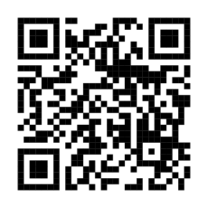

#  {.unnumbered}

```{r qr,  echo=FALSE, warning=FALSE}
library(qrcode)

qr <- qr_code('https://janvoss.github.io/Science_Lab')
#plot(qr)

generate_svg(qr, filename = "qr-titel.svg")

```

| ${}$ | Unterlagen: <https://janvoss.github.io/Science_Lab> |
|:----------------------------------:|:----------------------------------:|
|  | {width="40%"} |

# Was wird erarbeitet?

```{=html}
<style>body {text-align: justify}</style>
```

Das Science Lab steht in diesem Semester unter der Überschrift
**Ökonomische Antworten auf den Populismus**. Als Prüfungsleistungen
schreiben Sie in Dreierteams (zur Not: allein) eine kurze
**wissenschaftliche Ausarbeitung** und absolvieren Sie eine **mündliche
Prüfung**.

Grundlage Ihrer Seminararbeit sind die Beiträge aus dem Zeitgespräch in
der Zeitschrift
[Wirtschaftsdienst](https://www.wirtschaftsdienst.eu/inhalt/jahr/2026/heft/1/beitrag/oekonomische-antworten-auf-den-populismus.html)
zum oben genannten Thema:

@gold_populismus_2026; @gerling_verschworungsmythen_2026;
@horn_autoritare_2026; und @rosel_regionale_2026

In Ihrer Seminararbeit setzen Sie sich mit mindestens drei Texten aus
diesem Zeitgespräch auseinander. Als zusätzliche Literatur recherchieren
und verarbeiten Sie bitte mindestens *drei zusätzliche wissenschaftliche
Texte nach eigener Wahl, wobei mindestens ein Text auf Englisch sein
muss*. Merkmale wissenschaftlicher Texte werden wir im Seminar
besprechen.

In Ihrer Seminararbeit stellen Sie die Argumente ausgewählter Positionen
dar und setzen sie zueinander in Beziehung. Die von Ihnen ausgewählten
Aspekte des Themas sollten durch eine gemeinsame „gedankliche Klammer“
miteinander verbunden sein, die Sie in Ihrer Seminararbeit einleitend
darstellen.

In der mündlichen Prüfung zu diesem Seminar werden Grundlagen der
Wissenschaftstheorie, Prinzipien des wissenschaftlichen Arbeitens sowie
ausgewählte Inhalte aus dem Themenbereich des Seminars geprüft. Die
mündliche Prüfung bezieht sich *nicht* auf Ihre Seminararbeit.

# Warum?

-   Sie bekommen einen Einblick in **aktuelle praxisrelevante und
    methodische Fragen der ökonomischen Analyse**.

-   Sie erlernen **Grundlagen des wissenschaftlichen Arbeitens**, insb.
    Schreibens.

-   Sie erlernen den wissenschaftlichen Umgang mit **Literatur**.

-   Sie **arbeiten sich selbstständig** in ein Thema **ein**.

-   Sie üben **Teamarbeit**.

# Bis wann?

Abgabe aller Unterlagen bis zum *24. Juni 2026* bitte in elektronischer
Form im Portable Document Format (pdf) über den **Uploadordner für
Seminararbeiten** in neo. *Bitte benennen Sie unbedingt Ihre Datei in
dem Format „Nachname.pdf“.*

Wer sich für die Verwendung von $\LaTeX$ entscheidet, erhält drei
zusätzliche Tage Bearbeitungszeit.

Beachten Sie die Regeln und Tipps zum wissenschaftlichen Arbeiten.
Fragen Sie bei Bedarf!

# Worum geht es ?

```{r echo=FALSE, message=FALSE, warning=FALSE}

# Falls das Paket noch nicht installiert ist, bitte folgende Zeile ausführen:
# install.packages("DiagrammeR")

library(DiagrammeR)

# Erstellung und Anzeige des Graphen
grViz('
digraph Populismus_Struktur {

  # Allgemeine Graph-Einstellungen
  graph [rankdir=TB, size="10,10", nodesep=0.5, ranksep=0.8]
  node [shape=rectangle, style=filled, fontname="Arial", fontsize=10]

  # Sektion: Kernideologie
  Pop [label="POPULISMUS\\n(Inhaltlich nicht spezifizierte Kernideologie)", fillcolor="#E1F5FE", penwidth=2]

  # Sektion: Die Spaltung (Dualismus)
  subgraph cluster_dualismus {
    graph [label="Gesellschaftlicher Dualismus (Antagonismus)", color=lightgrey]
    Volk [label="Das \\"wahre\\" Volk\\n(Beherrschte Mehrheit)", fillcolor="#FFF9C4"]
    Elite [label="Die \\"korrupte\\" Elite\\n(Minderheit / Verschwörungsgruppen)", fillcolor="#FFCCBC"]
    Volk -> Elite [label="Antagonismus", dir=both, color=red]
  }

  Pop -> Volk
  Pop -> Elite

  # Sektion: Mechanismen & Kommunikation
  subgraph cluster_mechanismen {
    graph [label="Methoden & Kommunikation", color=lightgrey]
    Verschwörung [label="Verschwörungserzählungen\\n(Wissenschaft, Medien, Politik)", fillcolor="#F8BBD0"]
    Emotion [label="Emotionalisierung &\\nPolarisierung", fillcolor="#F8BBD0"]
    Fakten [label="Umwertung von Begriffen &\\nLosem Umgang mit Fakten", fillcolor="#F8BBD0"]
    Manichaeismus [label="Manichäismus &\\nExklusion", fillcolor="#F8BBD0"]
  }

  Pop -> Verschwörung
  Verschwörung -> Emotion
  Emotion -> Fakten
  Pop -> Manichaeismus

  # Sektion: Ökonomische & Soziale Treiber
  subgraph cluster_treiber {
    graph [label="Ökonomische Treiber", color=lightgrey]
    Angst [label="Subjektive Abstiegsängste\\n(Statusverlust Mittelschicht)", fillcolor="#C8E6C9"]
    Trans [label="Komplexe Transformation\\n(Globalisierung / Tech-Wandel)", fillcolor="#C8E6C9"]
    Ungleichheit [label="Wahrgenommene Ungleichheit", fillcolor="#C8E6C9"]
  }

  Angst -> Pop [style=dashed]
  Trans -> Angst
  Ungleichheit -> Angst

  # Sektion: Ideengeschichtliche Warnungen (wie im Original auskommentiert)
  /*
  subgraph cluster_theorie {
    graph [label="Ideengeschichtliche Perspektiven", color=lightgrey]
    Hayek [label="Hayek:\\nZusammenklicken durch \\"Wir vs. Andere\\"", shape=ellipse, fillcolor="#D1C4E9"]
    Eucken [label="Eucken:\\nVersagen des Wettbewerbs -> Autoritarismus", shape=ellipse, fillcolor="#D1C4E9"]
    Smith [label="Adam Smith:\\nAutoritäre Herrschaft = Rechtlosigkeit", shape=ellipse, fillcolor="#D1C4E9"]
    Olson [label="Mancur Olson:\\nAutokratie < Demokratie (Wachstum)", shape=ellipse, fillcolor="#D1C4E9"]
  }

  Pop -> Hayek [style=dotted]
  Pop -> Eucken [style=dotted]
  Pop -> Smith [style=dotted]
  Pop -> Olson [style=dotted]
  */

  # Sektion: Langfristige Folgen
  Folgen [label="LANGFRISTIGE FOLGEN:\\n- Korruption & Klientelismus\\n- Unterminierung von Institutionen\\n- Wirtschaftliche Stagnation", fillcolor="#FFCDD2", shape=doubleoctagon]
  
  Pop -> Folgen [color=red, penwidth=2]

}
')
```

# Ihre Seminararbeit

```{=html}
<style>body {text-align: justify}</style>
```

Das Erstellen einer wissenschaftlichen Arbeit erfordert die Beachtung
zahlreicher Vorgaben sowie ein planvolles Vorgehen. Sie müssen sich
systematisch in eine neue Materie einarbeiten, ohne dass Sie im Vorfeld
den Zeitaufwand der jeweiligen Arbeitsschritte genau kennen können.
Diese Hinweise sollen Ihnen die Arbeit etwas erleichtern.

## Umfang Ihrer Seminararbeit

Bitte beachten Sie in Ihrer Arbeit (von Dreierteams erstellt) die
Zeichenrestriktion von *12.000-15.000 Zeichen*, *inklusive Leerzeichen*.

## Struktur Ihrer Seminararbeit

Ihre Seminararbeit muss eine bestimmte Struktur aufweisen. Wesentliche
Elemente sind: Deckblatt, Verzeichnisse, Einleitung, Hauptteil, Fazit,
Literaturverzeichnis sowie ggf. Anhänge. Über Anforderungen an diese
Elemente werden wir im Seminar sprechen.

## Wissenschaftliches Schreiben

Das Ziel des wissenschaftlichen Schreibens besteht in der Präsentation
einer eigenständigen wissenschaftlichen Leistung. Der Grad der
Eigenständigkeit kann variieren. Im ersten Semester verlange ich von
Ihnen lediglich die eigenständige Verarbeitung fremder Gedanken. Dies
klingt einfacher als es ist. Spätere wissenschaftliche Texte von Ihnen
werden höheren Ansprüchen an die Eigenständigkeit genügen müssen.

Ein wesentliches Kriterium für einen wissenschaftlichen Schreibstil ist
die Nachvollziehbarkeit der Gedankenführung. Hierfür sollte die Sprache
möglichst klar sein. Ihre Schlussfolgerungen müssen auf
nachvollziehbaren Argumenten beruhen.

Eine Voraussetzung für die Präsentation einer wissenschaftlichen Arbeit
besteht in der Einhaltung bestimmter „Spielregeln“ des
wissenschaftlichen Schreibens. Eine der wichtigsten Regeln besteht
darin, dass immer deutlich werden muss, wenn Sie einen Gedanken nicht
selbst entwickelt, sondern aus einem anderen Text übernommen haben. Dies
werden wir im Seminar ausführlich besprechen.

Ihre Seminararbeit muss den Kriterien wissenschaftlichen Schreibens
genügen. Fügen Sie deshalb auch ein Literaturverzeichnis an. Zahlreiche
wertvolle Hinweise und Hilfestellungen zum wissenschaftlichen Schreiben
finden Sie in Büchern zum wissenschaftlichen Arbeiten wie z. B.
@Oehlrich15 oder @Berger-Grabner2016.

Darüber hinaus verlangt das Erstellen einer Seminararbeit bestimmte
handwerkliche Fähigkeiten der Texterstellung.

## Äußere Form Ihres Textes

Ein gut lesbarer Text sollte fehlerfrei sein. Gegenüber eigenen Texten
wird man mit der Zeit „betriebsblind“. Daher empfiehlt es sich, für die
Endredaktion KorrekturleserInnen einzusetzen, die den Text nach
Möglichkeit noch nicht kennen. Geben Sie den KorrekturleserInnen Zeit!

Der Leser, die Leserin möchte und sollte sich auf den Inhalt Ihres
Textes konzentrieren. Daraus folgt allerdings gerade nicht, dass die
äußere Form belanglos wäre -- im Gegenteil: Je weniger die äußere Form
als „störend“ empfunden wird, desto besser gelingt die Konzentration auf
das Wesentliche, den Inhalt. Daher sollte das Layout des Textes
übersichtlich und schlicht sein, sodass der Leser sich auf den Inhalt
des Textes gut konzentrieren kann.

Ich empfehle eine Schriftgröße von 11 oder 12 Punkten, 1,5-fachen
Zeilenabstand und Blocksatz (mit Silbentrennung). Zur guten Lesbarkeit
verwenden Sie bitte eine Serifenschrift (z. B. Times New Roman, Linux
Libertine oder Liberation Serif).

## Nutzung von Hard- und Software

### Software zur Texterstellung

Ein wissenschaftlicher Text entsteht typischerweise nicht (nur) mit
Stift und Papier, sondern unter Nutzung von Hard- und Software. Um einen
wissenschaftlichen Text verfassen zu können, muss man mit der
verwendeten Hard- und Software hinreichend vertraut sein. Dies betrifft
z.B. die Umsetzung von Formatierungsvorgaben mit einem
Textverarbeitungsprogramm, die Erstellung von Verzeichnissen usw.

Erfahrungsgemäß nutzen viele Studierende eine Version von Microsoft Word
oder von LibreOffice.

Erwägen Sie aber durchaus auch die Nutzung von $\LaTeX$. Die Nutzung von
$\LaTeX$ erlaubt das Erstellen sehr professionell formatierter
strukturierter Texte und unterstützt eine sehr gute Darstellung
mathematischer Ausdrücke.[^1]

[^1]: $\LaTeX$-Dokumente sind reine Textdokumente, die neben dem
    inhaltlichen Text auch Formatierungsanweisungen enthalten. Das
    Programm $\TeX$ bzw. pdf$\TeX$ erstellt daraus dann eine
    Druckvorlage, etwa im Format portable document format (pdf).

Die Verwendung von $\LaTeX$ erfordert eine Installation des jeweiligen
Programms und zahlreicher Pakete, die etwas lästig sein kann. Der
online-Service [Overleaf.com](http://www.overleaf.com) ermöglicht die
Nutzung von $\LaTeX$ ohne Installation von $\TeX$ und Pflege der
$\LaTeX$-Pakete. Sie brauchen dazu lediglich einen Webbrowser. Sie
schreiben in einem übersichtlichen Editorfenster. Ihr Quelltext wird
dann in ein pdf-Dokument kompiliert. Dieser Prozess stellt eine sehr
einfache Form der Nutzung von $\LaTeX$ dar.

Wenn Sie im Team arbeiten, sollten Sie sich hinsichtlich der Nutzung
eines Textverarbeitungsprogramms abstimmen. Auch unterschiedliche
Versionen des gleichen Programms können erfahrungsgemäß beim
Zusammenfügen von Dokumententeilen zu Problemen führen.

### Software zur Literaturverwaltung

Für die Verwaltung bibliografischer Angaben gibt es zahlreiche
Programme, die auch direkt mit Ihrem Textverarbeitungsprogramm
interagieren können. Zu nennen wären etwa Citavi, Zotero oder Mendeley.
Für das Erstellen einer kurzen Arbeit übersteigt der Aufwand der
Einarbeitung vermutlich den praktischen Nutzen. Für spätere
wissenschaftliche Arbeiten ist die Nutzung solcher Programme vermutlich
aber sehr hilfreich.[^2]

[^2]: Dieser Text wurde unter Nutzung von BibTex und Zotero erstellt.

## Nutzung von KI-gestützten Diensten

-   Im Bereich der künstlichen Intelligenz (KI) erfreuen sich Dienste
    auf der Basis von generative pre-trained transformers einer
    zunehmenden Beliebtheit.

-   Beispiele: Chat GPT, Microsoft Copilot, Google Gemini, Perplexity,
    Deep Seek, $\dots$

-   Diese Dienste können in menschlicher Sprache mit NutzerInnen
    interagieren

-   Sie verfügen über eine hohe Sprachkompetenz. Die inhaltliche
    Kompetenz ist von außen schwer einzuschätzen

-   Subjektiver Eindruck: Die Kompetenz entspricht der eines
    Gesprächspartners mit guter Allgemeinenbildung, aber mitunter ohne
    fachlich vertiefte Kenntnis oder nur sehr selektiver fachlicher
    Kenntnis

-   Inzwischen hohe Recherchekompetenz zumindest bei Themen, deren
    Nische nicht zu eng ist und über die es qualitativ hochwertige Texte
    frei verfügbar über das Internet gibt.

-   Problem: In der Regel kein (transparenter) Zugang zu
    kostenpflichtigen Fachartikeln und damit zu relevanten Teilen der
    aktuellen Literatur.

-   Generelle Haltung: Dienst ist ein beflissener Assistent, sagt aber
    nicht, wenn er etwas nicht weiß.

### Liefern die Dienste Wissen?

-   Wissensbegiff (s.u.): [Definition wissenschaftliches Wissen im
    Science_Lab](https://janvoss.github.io/Science_Lab/wissenschaftstheorie.html#anforderungen-an-wissenschaftliches-wissen)

-   Die Antworten von KI-gestützten Diensten sind

    -   inzwischen oft nachvollziehbar begründet und belegt (insbeondere
        bei Anfragen mit sogenanntem tiefem Nachdenken und
        Onlinerecherche)
    -   aber immer wieder nicht irritationsfest

-   Die Dienste haben schlicht keine Idee von einer Wirklichkeit, zu der
    ihre Antworten in einem (möglichst wahren) Bezug stehen sollten.

-   Die Dienste "überlegen" nicht, wenn sie eine Antwort suchen. Sie
    verwenden Algorithmen, die ihnen sagen, welche Antworten mit hoher
    Wahrscheinlichkeit "gute" Antworten sind. Das müssen nicht "wahre"
    Antworten sein.

-   Eigentlich halluzinieren die Dienst die ganze Zeit: Sie sprechen
    ohne Bewusstsein.

-   Dennoch können Sie sehr hilfreich sein.

<blockquote class="twitter-tweet" data-dnt="true">

<p lang="en" dir="ltr">

If all we had was ChatGPT, we could say, hmm “maybe hallucinations are
just a bug”, and fantasize that they weren’t hard to fix.<br><br>If all
we had was Gemini, we could say, hmm “maybe hallucinations are just a
bug”.<br><br>If all we had was Mistral, we could say, hmm “maybe
hallucinations…

</p>

— Gary Marcus (@GaryMarcus)
<a href="https://twitter.com/GaryMarcus/status/1781769926279409857?ref_src=twsrc%5Etfw">April
20, 2024</a>

</blockquote>

```{=html}
<script async src="https://platform.twitter.com/widgets.js" charset="utf-8"></script>
```

### KI-gestützte Dienste als Schummelsoftware

-   Komplette Arbeit schreiben

-   Schlechte Idee! (Aber inzwischen nicht mehr *so* schlecht)

    -   Halluzinieren i.e.S.

    -   keine Inhaltliche Kompetenz des Dienstes (und der/des
        Studierenden?)

    -   evtl. geringe Nachvollziehbarkeit der faktischenGrundlage

    -   evtll. Probleme bei der Erfüllung formaler Kriterien.

    -   Prüfungstechnisch: Kein eigener Wissenserwerb $\rightarrow$
        Täuschungsversuch

### KI-gestützte Dienste als Recherchedienst

-   Das gelingt immer besser, aber auch hier nicht immer ein gemeinsames
    Verständnis vom Thema bzw. der Aufgabe

-   Durchaus beachtliche Wahrscheinlichkeit von inhaltlichen Fehlern
    oder aber bestimmten inhaltlichen Gewichtungen, die Sie nicht für
    richtig halten müssen.

-   Die inhaltliche Bewertung der Rechercheleistung müssen *Sie*
    leisten. Das kann Ihnen der Dienst nicht abnehmen.

-   Eher Gesprächspartner als Orakel

-   *Kein* umfassender Zugriff auf wissenschaftliche Literatur

### Konzeptionelle Unterstützung

-   Fragestellungen diskutieren

-   Vorschläge für wichtige Aspekte geben lassen

-   Ideen "gemeinsam" reflektieren

-   Gliederung erstellen und verfeinern lassen

-   Gliederung/ Gedanken zur Diskussion stellen

-   Mathematische Konzepte erklären lassen

-   $\dots$

### Redaktionelle Unterstützung

-   Fehlerkorrektur

-   Formulierungshilfen

### Literatur auswerten

-   Einige Dienste erlauben das Hochladen und Auswerten von
    pdf-Dokumenten und können Zusammenfassungen erstellen und Fragen
    beantworten

-   Das kann für einen Überblick sehr interessant sein, es ersetzt
    typischerweise aber nicht das Lesen der Texte, die Sie tatsächlich
    verwenden möchten.

-   Interessant: Auch Videos könnne teilweise
    zusammengefasst/ausgewertet werden.

### Schreiben von Code

-   Große Unterstützung bei der Erstellung von Code in gängigen Sprachen

-   Neben den genannten Diensten etwa github Copilot oder Google Colab

### Genereller Nutzungshinweis

-   Präzise Formulierung der Aufgabenstellung (prompt) erhöht die
    inhaltliche Qualität der Antworten.

-   Dazu gehören u.U. auch Angaben über den Kontext und den gewünschten
    Sprachstil

-   Kommunikation mit Dienst als Gespräch sehen. Nicht unbedingt mit der
    ersten Antwort zufrieden geben, sondern weiter damit arbeiten

-   Geben Sie nicht die inhaltliche Verantwortung an den KI-gestützten
    Dienst ab. Die Dienste sollen sie nicht schlauer machen/erscheinen
    lassen sondern produktiver machen!

### Zusammenfassung

<iframe src="https://www.linkedin.com/embed/feed/update/urn:li:share:7312865778536505344?collapsed=1" height="399" width="504" frameborder="0" allowfullscreen title="Eingebetteter Beitrag">

</iframe>

# Einarbeiten in die Materie: Literaturrecherche und -auswertung

```{=html}
<style>body {text-align: justify}</style>
```

## Grundsätzliches

Sie müssen sich mit einer für sie noch nicht vertrauten Materie
auseinandersetzen. Dies erfordert, dass Sie erkennen, welche
Informationen Sie benötigen. Im nächsten Schritt müssen Sie sich
überlegen, wie Sie sie erhalten können.

Die Literaturrecherche erfordert Übung und Geduld. Passende Literatur
über ein Thema zu finden, mit dem man sich noch nicht gut auskennt, ist
immer eine Herausforderung. Auch besteht die Gefahr, dass man sich
„verzettelt“ und viel Zeit für wenig geeignete Texte aufwendet. Für
dieses Seminar habe ich Ihnen umfangreiche Startliteratur vorausgewählt.

## Fundstellen für wirtschaftswissenschaftliche Artikel

Fachartikel im Bereich VWL erscheinen typischerweise in
wissenschaftlichen Zeitschriften. Hiervon gibt es insb. im
englischsprachigen Bereich inzwischen unzählige, die sich hinsichtlich
ihrer inhaltlichen Schwerpunkte, der Qualitätsansprüche an Artikel,
ihrer Reputation sowie der Lesbarkeit gerade für AnfängerInnen stark
unterscheiden.

Für den Einstieg empfinden Sie vielleicht die folgenden Zeitschriften
als hilfreich:

-   **Deutschsprachige Zeitschriften**

    -   [Aus Politik und
        Zeitgeschichte](https://www.bpb.de/shop/zeitschriften/apuz/)
        [^3]

    -   [List Forum für Wirtschafts- und
        Finanzpolitik](https://link.springer.com/journal/41025/volumes-and-issues)

    -   [Perspektiven der
        Wirtschaftspolitik](https://www.degruyter.com/journal/key/pwp/html?lang=de#issues)

    -   [Wirtschaftsdienst](https://www.wirtschaftsdienst.eu/)

    -   [Zeitschrift für
        Wirtschaftspolitik](https://www.degruyter.com/journal/key/zfwp/html?lang=de)

-   **Englischsprachige Zeitschriften**

    -   [Intereconomics](https://www.intereconomics.eu/)

    -   [Journal of Economic
        Literature](https://www.aeaweb.org/journals/JEL)

    -   [Journal of Economic
        Perspectives](https://www.aeaweb.org/journals/jep)

    -   [Journal of Economic
        Surveys](https://onlinelibrary.wiley.com/journal/14676419).

[^3]: Hierbei handelt es sich nicht um eine wirtschaftswissenschaftliche
    Fachzeitschrift i. e. S. Aber es werden mitunter
    wirtschaftswissenschaftlich relevante Themen behandelt.

Darüber hinaus sind z.B. die Gutachten des Sachverständigenrates zur
Begutachtung der gesamtwirtschaftlichen Lage oder die Monatsberichte der
Bundesbank für einige Themen hilfreiche Fundstellen.

## Suchportale

Suchportale können die Suche nach Literatur erheblich erleichtern. Hier
seien beispielhaft nur einige genannt:

-   [EconLit](https://dbis.uni-regensburg.de/warpto.php?bib_id=hfwu&color=2&titel_id=6926&url=http%3A%2F%2Fwww.redi-bw.de%2Fdb%2Fstart.php%3Fdatabase%3DEconLit-FT-ebsco),
    ein sehr umfangreiches Suchportal insbesondere für ökonomische Texte

-   [EconBiz](https://www.econbiz.de), ein Suchportal der
    Zentralbibliothek für Wirtschaftswissenschaften (ZBW) in Kiel

-   [Google Scholar](http://scholar.google.de), das Suchportal für
    wissenschaftliche Veröffentlichungen von Google

-   [Mendeley](https://www.mendeley.com), ein
    Literaturverwaltungsprogramm mit online-Suchfunktion, das zum Verlag
    Elsevier gehört. Um Mendeley nutzen zu können, muss man ein
    (gebührenfreies) Nutzerkonto einrichten.

-   [Semantic Scholar](https://www.semanticscholar.org/), KI-gestütztes
    Rechercheportal für wissenschaftliche Texte

Alle diese Portale weisen verschiedene Vor- und Nachteile auf.[^4] Den
besten Überblick verschafft man sich durch Ausprobieren.

[^4]: Gerade bei den letzten beiden Portalen sollten Nutzer sich bewusst
    sein, dass sie Daten preisgeben, die kommerziell genutzt werden
    könnten.

## Zugang zu Literatur

Wissenschaftliche Fachzeitschriften erscheinen neben der gedruckten Form
v. a. in elektronischer Form. Teile sind gelegentlich frei zugänglich,
der größte Teil ist allerdings kostenpflichtig. Über die
Hochschulbibliothek haben Sie Zugang zu einem großen Teil des
elektronischen Angebots der wirtschaftswissenschaftlichen
Fachzeitschriften.[^5] Viele Fachbücher erscheinen ebenfalls in
elektronischer Form. Auch auf viele Fachbücher in elektronischer Form
haben Sie über die Bibliothek Zugriff. Für den physischen Zugriff auf
(gedruckte) Bücher lohnt sich ein Blick in den Bestand der
Hochschulbibliothek. Bei Nichtvorhandensein besteht grundsätzlich die
Möglichkeit zu einer Fernleihe.

[^5]: Der nicht-autorisierte Zugriff auf Fachliteratur aus eigentlich
    kostenpflichtigen Fachzeitschriften erfreut sich allerdings offenbar
    immer größerer Beliebtheit [@Bohannon2016; @McKenzie2017;
    @Himmelstein2017; @Bjork2017].

# Wissenschaftstheorie

```{=html}
<style>body {text-align: justify}</style>
```

Die Prinzipien des wissenschaftlichen Arbeitens leiten sich aus
bestimmten Vorstellungen über Wissen sowie über Wahrheit ab. Ein
Verständnis dieser Begriffe hat über den Wissenschaftsbetrieb hinaus
Bedeutung, da dies auch die Grundlagen eines gesellschafltichen
Diskurses berührt.

Im Seminar werden Grundlagen der Wissenschaftstheorie insbesondere
basierend auf @ElKassar21, @Kolmer17 und @Weingart2017 besprochen.

## Wissensbegriffe

-   Phänomenales Wissen

    Unmittelbare Sinneseindrücke (Schmerz, Wärme, Kälte, ...)

-   Praktisches Wissen

    -   Die Fähigkeit, bestimmte Tätigkeiten auszuführen, evtl. ohne die
        Fähigkeit zu erklären, wie es geht

    -   Fahrradfahren, Technike des Sports, ein Instrument spielen...

    -   Keith Richards: "I know I can do it, but I don't know *how* I do
        it."

    <blockquote class="twitter-tweet" data-media-max-width="560" data-dnt="true">

    <p lang="en" dir="ltr">

    81-year-old Keith Richards proving he still rocks
    <a href="https://t.co/OOeBcW4oCK">pic.twitter.com/OOeBcW4oCK</a>

    </p>

    — 🎸 Rock History 🎸 (@historyrock_)
    <a href="https://twitter.com/historyrock_/status/1912174076506022286?ref_src=twsrc%5Etfw">April
    15, 2025</a>

    </blockquote>

    ```{=html}
    <script async src="https://platform.twitter.com/widgets.js" charset="utf-8"></script>
    ```

-   **Satzförmiges Wissen**

    -   Über Sprache vermittelbares Wissen

    -   Kann abstrakte Sachverhalte beinhalten

## Anforderungen an (wissenschaftliches) Wissen

### Wissen als wahre begründete Meinung

-   Wissenschaftliches **Wissen ist wahre, begründete Meinung**
    [@Detel08_GK_Philosophie4; @ElKassar21]

    -   Nur *wahre* Meinung? Die Wahrheit von Aussagen ist nicht immer
        beweisbar (Formalwissenschaften vs. empirische Wissenschaften)
        $\rightarrow$ Wahrheit gegenwärtig plausibel $\rightarrow$
        Wissen ist nicht Gewissheit

-   Weitere Anforderungen [@ElKassar21]

    -   Die **Begründung**/Rechtfertigung **genügt bestimmten
        Ansprüchen**.
        -   Begründung ist **intersubjektiv überprüfbar**/ wird in
            **logisch geordneter Form** präsentiert (oder kann zumindest
            so präsentiert werden )\
        -   Begründung ist in einen **nachvollziehbaren
            Begründungszusammenhang** eingebettet. Die dem Wissen
            zugrundeliegende Rechtertigungskette gehört zum Wissen.\
            $\rightarrow$ **Wissenschaftliches Wissen existiert
            innerhalb von Zusammenhängen**\
            $\rightarrow$ Wissenschaftliches Wissen bezieht sich i.d.R.
            nicht auf singuläre Tatsachen sondern **allgemeine
            Zusammenhänge**.
    -   Wissen ist **irrtumssensibel**, es *könnte* also falsch sein und
        durch gerechtfertigte Kritik widerlegbar/anzweifelbar sein
    -   Wissen ist **irritationsfest**, die Überzeugung, dass es wahr
        ist, hält auch (zumindest zunächst) Einwänden stand.

### Aber: was ist Wahrheit?

```{r, echo=FALSE, warning=FALSE, message=FALSE}

# Installiere das Paket, falls noch nicht geschehen:
# install.packages("DiagrammeR")

library(DiagrammeR)

# Erstellen und Anzeigen des Graphen
grViz("
digraph Wahrheitstheorien {

  # --- Graphen-Initialisierung ---
  graph [rankdir = TB, fontname = 'Arial']
  node [style = 'filled, rounded', fontname = 'Arial', shape = rectangle]

  # --- ZENTRALER KNOTEN ---
  Truth [label = 'DIE NATUR DER WAHRHEIT', shape = doubleoctagon, fillcolor = '#eceff1', penwidth = 3]

  # --- BRANCH 1: Korrespondenz (Klassik & Realismus) ---
  subgraph cluster_correspondence {
    label = 'Korrespondenztheorie (Aristoteles)'
    style = filled
    color = '#e3f2fd'
    Match [label = 'Übereinstimmung mit der Realität\\n(Strukturelle Korrespondenz)', fillcolor = '#90caf9']
    External [label = 'Externe Bedingung\\n(Subjektunabhängig)', fillcolor = '#bbdefb']
    
    Match -> External
  }

  # --- BRANCH 2: Kohärenz & Konstruktion ---
  subgraph cluster_coherence {
    label = 'Systemische Ansätze'
    style = filled
    color = '#f3e5f5'
    Coherence [label = 'Kohärenztheorie\\n(Widerspruchsfreiheit im System)', fillcolor = '#ce93d8']
    Constructivism [label = 'Konstruktivismus\\n(Wahrheit als Konstruktion)', fillcolor = '#e1bee7']
    
    Coherence -> Constructivism [style = dotted, label = 'Subjektbezug']
  }

  # --- BRANCH 3: Wissenschaftstheorie (Dynamik) ---
  subgraph cluster_science {
    label = 'Wissenschaft & Fortschritt'
    style = filled
    color = '#e8f5e9'
    Popper [label = 'Falsifikation (Popper)\\n(Vorläufige Bewährung)', fillcolor = '#a5d6a7']
    Kuhn [label = 'Paradigmen (Kuhn)\\n(Sozialer Prozess)', fillcolor = '#a5d6a7']
    Approx [label = 'Wahrheitsnähe\\n(Approximation)', fillcolor = '#c8e6c9']
    
    Popper -> Approx
    Kuhn -> Popper [style = dashed, label = 'Krisen']
  }

  # --- BRANCH 4: Logische Typisierung ---
  subgraph cluster_types {
    label = 'Arten der Wahrheit'
    style = filled
    color = '#fff3e0'
    Analytic [label = 'Analytisch\\n(Logik / Definition)', fillcolor = '#ffcc80']
    Synthetic [label = 'Synthetisch\\n(Faktische Welt)', fillcolor = '#ffcc80']
  }

  # --- SYNTHESE & ZIEL ---
  Democracy [label = 'Sozialer Konsens\\n(durch öffentliche Auseinandersetzung)', shape = hexagon, fillcolor = '#dcedc8']

  # --- VERBINDUNGEN ZUR MITTE UND ENDPUNKTEN ---
  Truth -> Match
  Truth -> Coherence
  Truth -> Popper
  Truth -> Analytic

  External -> Democracy [label = 'Faktizität']
  Coherence -> Democracy [label = 'Konsens']

}
")

```

### Wissen als rationale Behauptung

-   Eine Behauptung beinhaltet dem Anspruch, dass eine andere Person der
    Behauptung zustimmen kann.

-   Eine **rationale Behauptung** macht ihre Beziehung zu den Gründen,
    aus denen sie ihren Anspruch auf Zustimmung ableitet, sichtbar und
    legt sie zur Überprüfung offen (s. auch unten die Philosophische
    Happy Hour zur Wahrheit).

-   Durch die Offenlegung kann über die Gründe konstruktiv diskutiert
    werden.

(Die philosophische Frage nach der Feststellbarkeit der Wahrheit einer
Aussagen lässt sich umgehen, indem man sich auf die offengelegten Gründe
konzentriert )

```{r, echo=FALSE, warning=FALSE, message=FALSE}

library(DiagrammeR)

grViz("
digraph Wissen_als_Behauptung {

  # --- Globale Formatierung ---
  graph [rankdir = TB, fontname = 'Helvetica,Arial,sans-serif']
  node [shape = rectangle, style = filled, fontname = 'Helvetica,Arial,sans-serif']

  # --- CLUSTER 1: DAS KLASSISCHE JTB-MODELL & DAS WAHRHEITSPROBLEM ---
  subgraph cluster_classic {
    label = 'I. Klassisches Modell (Problem der Korrespondenz)'
    style = filled
    fillcolor = '#EBF5FB'

    Belief [label = 'Meinung\\n(Interner Zustand)', fillcolor = '#D6EAF8']
    Just [label = 'Begründung\\n(Interner Zustand)', fillcolor = '#D6EAF8']
    Truth [label = 'Wahrheit\\n(Externe Korrespondenz)', fillcolor = '#F1948A']

    Gap [label = 'Erkenntnistheoretische Lücke:\\nKein direkter Zugriff auf\\nsubjektunabhängige Realität', shape = doubleoctagon, fillcolor = 'white']

    Belief -> Gap [style = dotted]
    Just -> Gap [style = dotted]
    Gap -> Truth [dir = none, style = dotted] // Verbindung zur Wahrheit verdeutlichen
    Truth -> Gap [dir = back]
  }

  # --- CLUSTER 2: DIE SKEPTISCHE BARRIERE ---
  subgraph cluster_skeptic {
    label = 'II. Münchhausen-Trilemma (Begründungsnot)'
    style = filled
    fillcolor = '#FDEDEC'

    Trilemma [label = 'Unmöglichkeit absoluter Gewissheit', fontname = 'Helvetica-Bold']
    Regress [label = 'Infiniter Regress']
    Zirkel [label = 'Zirkelschluss']
    Dogma [label = 'Dogmatischer Abbruch']

    Trilemma -> Regress
    Trilemma -> Zirkel
    Trilemma -> Dogma
  }

  # --- CLUSTER 3: DIE MODERNE LÖSUNG (RATIONALE BEHAUPTUNG) ---
  subgraph cluster_modern {
    label = 'III. Wissen als Rationale Behauptung'
    style = filled
    fillcolor = '#E8F5E9'

    Assertion [label = 'Epistemisches Versprechen\\n(Rationale Behauptung)', fillcolor = '#A9DFBF', fontname = 'Helvetica-Bold']
    Resp [label = 'Begründung und\\n Einladung zur Auseinandersetzung', fillcolor = 'white']
    Stability [label = 'Irritationsfest\\n(Stabil gegen Einwände)', fillcolor = 'white']
    Fallible [label = 'Irrtumssensibel\\n(revidierbar/fallibel)', fillcolor = 'white']

    Assertion -> Resp
    Assertion -> Stability
    Assertion -> Fallible
  }

  # --- CLUSTER 4: PRAXIS & DEMOKRATIE ---
  subgraph cluster_praxis {
    label = 'IV. Wissenschaft & Gesellschaft'
    style = filled
    fillcolor = '#FEF9E7'

    Science [label = 'Wissenschaft:\\nBeste Erklärung (Abduktion)', fillcolor = '#F9E79F']
    Demo [label = 'Demokratie:\\nTransparenter Dialog &\\nSelbstkorrektur', fillcolor = '#F9E79F']

    Science -> Demo [label = 'Referenzrahmen']
  }

  # --- Hauptverbindungen zwischen den Clustern ---
  Gap -> Trilemma [label = 'führt zu']
  Trilemma -> Assertion [label = 'Shift zu Geltung']
  
  # Hinweis: ltail/lhead (Cluster-Verbindungen) erfordern 'compound=true'
  graph [compound = true]
  Assertion -> Science [ltail = cluster_modern, lhead = cluster_praxis]

}
")
```

Die klassische Definition von Wissen als wahre, begründete Meinung
stellt drei notwendige Bedingungen auf, damit ein Subjekt
rechtmäßigerweise behaupten kann, etwas zu wissen. Neben der
psychologischen Komponente der Überzeugung und der logischen
Notwendigkeit einer rationalen Begründung bildet die Wahrheit das
entscheidende objektive Kriterium. Wahrheit wird dabei zumeist im Sinne
der Korrespondenztheorie verstanden, wonach eine Aussage genau dann wahr
ist, wenn der behauptete Sachverhalt mit der Wirklichkeit übereinstimmt.
Diese Wahrheitsbedingung erweist sich jedoch erkenntnistheoretisch als
problematisch, da sie eine externe Bedingung darstellt, auf die das
erkennende Subjekt keinen direkten Zugriff hat. Während Überzeugungen
und Rechtfertigungen interne kognitive Zustände sind, die dem
Bewusstsein unmittelbar zugänglich sein müssen, bleibt die
Übereinstimmung mit einer subjektunabhängigen Realität oft eine
hypothetische Annahme [@schurz_erkenntnistheorie_2021].

Da absolute Gewissheit über die Außenwelt aufgrund grundlegender
skeptischer Herausforderungen wie dem Münchhausen-Trilemma unerreichbar
bleibt, wird menschliches Wissen in der modernen Philosophie meist als
Vermutungswissen oder Wahrscheinlichkeitswissen charakterisiert. Jeder
Begründungsversuch mündet letztlich entweder in einen infiniten Regress,
einen Zirkelschluss oder einen dogmatischen Abbruch. In der Konsequenz
bedeutet dies, dass wir uns der Wahrheit unserer Erkenntnisse nie
gänzlich sicher sein können, sondern lediglich Grade der Bewährung
erreichen [@schurz_erkenntnistheorie_2021]. Wenn die Wahrheit als
Korrespondenz mit der Realität nicht zweifelsfrei feststellbar ist,
verschiebt sich der Fokus des Wissensbegriffs hin zur rationalen
Behauptung [@arnold_philosophische_2023. Eine solche Behauptung fungiert
als ein epistemisches Versprechen, für dessen Verlässlichkeit der
Sprechende die Verantwortung übernimmt [@arnold_philosophische_2023;
@schurz_erkenntnistheorie_2021].

Das Konzept des Wissens als rationale Behauptung setzt voraus, dass eine
Aussage nicht nur zufällig wahr ist, sondern auf Gründen basiert, die
für andere sichtbar und überprüfbar gemacht werden. Eine rationale
Behauptung zeichnet sich dadurch aus, dass sie ihre Beziehung zu den
stützenden Gründen offenlegt, anstatt sich lediglich auf eine
vermeintliche Evidenz oder Autorität zu berufen. Wissen wird so zu einer
Form der begründeten Geltung, die sich im sozialen und
wissenschaftlichen Diskurs bewähren muss. Damit eine Überzeugung als
Wissen gelten kann, muss sie über die bloße Meinung hinausgehen und eine
Stabilität aufweisen, die sie irritationsfest gegenüber Einwänden macht.
Gleichzeitig bleibt sie jedoch irrtumssensibel, was bedeutet, dass sie
im Lichte neuer Informationen oder berechtigter Kritik grundsätzlich
revidierbar ist [@arnold_philosophische_2023; @ElKassar21;
@schurz_erkenntnistheorie_2021].

In der wissenschaftlichen Praxis führt diese Sichtweise dazu, dass nicht
von ewigen Wahrheiten, sondern von vorläufig gesichertem Wissen
gesprochen wird [@Weingart2017]. Wissenschaftliche Modelle und Theorien
werden als theoriegeleitete Repräsentationen akzeptiert, solange sie die
beste verfügbare Erklärung für beobachtete Phänomene liefern und eine
hohe Voraussagekraft besitzen. Der Bezug zur Wirklichkeit wird hierbei
abduktiv erschlossen, wobei die erfolgreichste Theorie als die
wahrscheinlich wahrheitsnächste gilt. In einer demokratisch verfassten
Gesellschaft dient dieses methodisch gesicherte Wissen als notwendiger
Referenzrahmen für rationale Entscheidungen und den Ausgleich von
Interessen. Die Autorität von Fakten beruht dabei nicht auf einem
unfehlbaren Zugriff auf die Wahrheit, sondern auf der Transparenz der
Methoden und der ständigen Bereitschaft zur Selbstkorrektur. Wissen als
rationale Behauptung ermöglicht somit einen transparenten Dialog über
die Wirklichkeit, selbst wenn deren letzte Beschaffenheit dem Menschen
verborgen bleiben mag.

### Die Bedeutung des Wissensbegriffes für den Wissenschaftsbetrieb

-   Derartiges Wissen oder derartige Behauptungen bestehen nicht
    zwingend nur aus wahren Aussagen (Irrtum kann immer noch entdeckt
    werden)

-   Aber eine Person, die diese Ansprüche gelten lässt, kann einfordern
    im Diskurs ernst genommen zu werden

-   Ernsthaft kann man über dieses Wissen nicht beliebig reden.
    (Konkurrierende) Positionen zu diesem Wissen können ihrerseits nur
    Geltung einfordern, wenn sie sich diesen Ansprüchen stellen

## Psychologie des Wissens: Kontakt mit dem Unwissen

```{r, eval=F, echo=FALSE}
## Code erzeugt und speichert das gewünschte Video, führt aber in einen Error.

## Workaround: Einmal laufen lassen, um Video zu erzeugen, dann auf eval=F setzen, damit Error umgangen wird, und Seite weiter erzeugen

# Install and load necessary libraries
# install.packages("ggplot2")
# install.packages("gganimate")
# install.packages("ggforce")
# install.packages("av")  # Für Video-Export
library(ggplot2)
library(gganimate)
library(ggforce)
library(av)  # Für Video-Export
library(dplyr)

# Define parameters
max_radius <- 1
circle_center_x <- 0
circle_center_y <- 0

# Create data for animation
animation_data <- data.frame(
  frame = 1:100,
  radius = seq(0.01, max_radius, length.out = 100)
)

# Create the plot
p <- ggplot() +
  # Schwarzer Hintergrund für den gesamten Plot
  theme_void() +
  theme(plot.background = element_rect(fill = "black", color = NA)) +
  
  # Schwarzes Rechteck als Hintergrund
  annotate("rect", 
           xmin = -max_radius*1.2, 
           xmax = max_radius*1.2, 
           ymin = -max_radius*1.2, 
           ymax = max_radius*1.2, 
           fill = "black") +
  
  # Weißer Kreis mit präzisen Grenzen
  geom_circle(data = animation_data,
              aes(x0 = circle_center_x, 
                  y0 = circle_center_y, 
                  r = radius),
              fill = "white",
              color = NA) +
  
  # "Wissen" Text
  geom_text(aes(x = 0, y = 0, label = "Wissen"),
            color = "black",
            size = 6) +
  
  # "Unwissen" Text (positioniert außerhalb des Kreises)
  annotate("text",
           x = max_radius * 1.1,
           y = max_radius * 1.1,
           label = "Unwissen",
           color = "white",
           size = 5) +
  
  # Fester Koordinatenbereich
  coord_fixed(xlim = c(-max_radius*1.2, max_radius*1.2),
              ylim = c(-max_radius*1.2, max_radius*1.2)) +
  
  # Animation
  transition_manual(frame)

# Create animation
anim <- animate(p, 
                nframes = 100, 
                width = 800, 
                height = 800, 
                fps = 20,
                renderer = av_renderer())

# Save as MP4 video
anim_save("animation_video.mp4", animation = anim)

# Optional: Auch als GIF speichern
anim_save("animation.gif", animation = anim)
```


------------------------------------------------------------------------

## Exkurs: Philosophische Happy Hour zur Wahrheit {.unnumbered}

<iframe width="560" height="315" src="https://www.youtube-nocookie.com/embed/5BZ9ThwirdM?si=V31nf9MBclwn0Nap" title="YouTube video player" frameborder="0" allow="accelerometer; autoplay; clipboard-write; encrypted-media; gyroscope; picture-in-picture; web-share" allowfullscreen>

</iframe>

## Wissen in Theorie, Empirie und Praxis

### Grundlegende Begriffe

Wissenschaftliche Erkenntnisprozesse lassen sich idealisierend als ein
**dynamisches Wechselspiel zwischen theoretischen Entwürfen,
vereinfachenden Modellen, empirischen Daten und der praktischen
Anwendung** begreifen.

Am Anfang dieses Prozesses stehen häufig vortheoretische Vorstellungen
oder **Intuitionen**, die im Rahmen eines kreativen Prozesses Ideen für
Wirkungszusammenhänge liefern kann, ohne, dass diese bereits
systematisch ausgearbeitet sind.

Diese intuitiven Vermutungen werden im Rahmen einer **Theorie**
systematisiert, die allgemeine Gesetzmäßigkeiten postuliert und darauf
abzielt, eine Vielzahl von Einzelereignissen durch wenige elementare
Prinzipien vereinheitlichend zu erklären
[@schurz_erkenntnistheorie_2021; @healy_fuck_2017]. Eine Theorie bildet
dabei den ordnenden Rahmen, der über die bloße Beschreibung von
Einzelfakten hinausgeht und oft theoretische Begriffe für nicht direkt
beobachtbare Entitäten enthält [@schurz_erkenntnistheorie_2021].

Da Theorien aufgrund ihres hohen Abstraktionsgrades oft zu komplex sind,
um unmittelbar auf spezifische Situationen angewandt zu werden, dienen
**Modelle** als theoriegeleitete Repräsentationen zu erklärender
Phänomene [@schurz_erkenntnistheorie_2021]. Modelle sind
notwendigerweise unvollständig und vereinfachen die Realität durch
gezielte Idealisierungen oder Vernachlässigbarkeitsannahmen, um ein
Problem überhaupt erst mathematisch oder empirisch handhabbar, also
traktabel, zu machen [@schurz_erkenntnistheorie_2021;
@hindriks_tractability_2006]. Ein Modell fungiert somit als ein
Stellvertreter, der den abstrakten Kern einer Theorie mit der konkreten
Empirie verbindet, indem er die theoretischen Begriffe für messbare
Daten operationalisiert [@schurz_erkenntnistheorie_2021].

Unter **Empirie** wird in diesem Zusammenhang die Gesamtheit der durch
systematische Beobachtung oder kontrollierte Experimente gewonnenen
Informationen verstanden, welche die Basis für die Prüfung
wissenschaftlicher Aussagen bilden [@schurz_erkenntnistheorie_2021;
@Weingart2017].

Die Verbindung dieser Elemente führt zu einem **iterativen
Fortschritt**, der **als Feedback-Schleife zwischen Theorie und Praxis**
organisiert ist [@box_science_1976]. In der Praxis werden aus
theoretischen Modellen spezifische Voraussagen über reale Abläufe
abgeleitet. Wenn diese theoretischen Erwartungen im Abgleich mit der
empirischen Erfahrung Diskrepanzen aufweisen, dient dieses Fehlersignal
als Impuls, um die zugrunde liegende Theorie zu modifizieren oder
vollständig zu revidieren [@schurz_erkenntnistheorie_2021;
@Weingart2017]. Hierfür wird dann gegebenenfalls wieder auf
vortheoretische Intuition zurückgegriffen.

Während die Empirie das Material für diesen Abgleich liefert, stellt die
**Praxis** den realen Anwendungsbereich dar, in dem sich
wissenschaftliches Wissen durch Verlässlichkeit bewähren muss
[@Kolmer17; @speiser_wissenschaftsrecht_2022]. In einer Welt der
Ungewissheit dient dieses methodisch gesicherte Wissen schließlich dazu,
das menschliche Urteilsvermögen zu stützen und rationale Entscheidungen
in komplexen Systemen vorzubereiten [@schurz_erkenntnistheorie_2021]. Es
kann den Umgang mit der Ungewissheit unterstützen. Es kann sie nicht
beseitigen.

### Die Notwendigkeit von theoretischen Vorstellungen für den Erkenntnisprozess

Die Unmöglichkeit, Kausalität direkt wahrzunehmen, bildet eine der
grundlegendsten Herausforderungen der Erkenntnistheorie und der
empirischen Wissenschaften [@chavez_causality_2026]. Beobachtbar sind
bestenfalls regelmäßige Abfolgen von Ereignissen oder deren räumliche
Nähe, niemals jedoch die notwendige kausale Verknüpfung selbst
[@schurz_erkenntnistheorie_2021; @chavez_causality_2026]. Das, was wir
als Kausalität bezeichnen, ist aus dieser skeptischen Perspektive primär
eine Projektion unseres Geistes, die auf der Gewohnheit basiert,
wiederkehrende Muster in der Vergangenheit als zukünftige
Notwendigkeiten zu interpretieren. **In der statistischen Analyse äußert
sich dieses Problem darin, dass Korrelation nicht mit Kausalität
gleichgesetzt werden darf**, da ein statistischer Zusammenhang durch
verborgene Drittvariablen, umgekehrte Kausalität oder bloße
Selektionseffekte verzerrt sein kann. **Ebenso wenig darf das Fehlen
einer Korrelation als Beweis für die Abwesenheit von Kausalität gewertet
werden**, da nichtlineare Effekte, sich gegenseitig aufhebende
Kausalpfade oder eine erhebliche Heterogenität innerhalb der
Untersuchungsgruppen tatsächliche Wirkungszusammenhänge maskieren können
[@chavez_causality_2026].

Da wir somit Kausalität niemals unmittelbar wahrnehmen, sondern immer
nur abduktiv erschließen können, sind wissenschaftliche Modelle
unverzichtbare Werkzeuge, um Hypothesen über die Beschaffenheit der
Realität strukturiert zu formulieren [@schurz_erkenntnistheorie_2021;
@chavez_causality_2026].

Ökonomische Modelle fungieren dabei als theoriegeleitete
Repräsentationen, die das vorhandene Wissen über die Natur oder die
Gesellschaft ordnen, anstatt die ungefilterte Wirklichkeit abzubilden.
Innerhalb dieser Modelle wird eine analytische Struktur geschaffen, die
auf logisch zwingenden Deduktionen beruht, welche die Wahrheit gesetzter
Prämissen auf die Konklusion übertragen. **Diese analytische Wahrheit
dient im Modell als Stellvertreter für synthetische Vermutungen über die
Außenwelt**, wobei die logische Konsistenz des Modells sicherstellt,
dass die postulierten Zusammenhänge in einer idealisierten Welt
widerspruchsfrei funktionieren [@schurz_erkenntnistheorie_2021]. Der
Übergang von diesen analytisch wahren Aussagen zur Beschreibung der
faktischen Wirklichkeit bleibt jedoch ein hypothetisches und unsicheres
Unterfangen, da Modelle die Realität notwendigerweise bestenfalls nur
homomorph, also vergröbert und lückenhaft, abbilden können. **Jedes
Modell ist in diesem Sinne ontologisch betrachtet „falsch“**, da es auf
idealisierenden Annahmen erster Ordnung beruht
[@schurz_erkenntnistheorie_2021; @box_science_1976; @Musgrave81;
@hindriks_tractability_2006].

Diese deskriptive Unwirklichkeit von Annahmen ist jedoch kein
methodischer Fehler, sondern eine notwendige Bedingung für die
wissenschaftliche Handhabbarkeit komplexer Probleme. **Ein Modell ist
dann nützlich, wenn es trotz seiner Vereinfachungen den kausalen Kern
eines Phänomens isoliert und dadurch erfolgreiche Voraussagen oder
plausible Erklärungen ermöglicht** [@hindriks_tractability_2006;
@ungureanu_uniformity_2013; @Maki00]. Die Rechtfertigung für die
Verwendung solcher „falschen“ Modelle liefern Annahmen zweiter Ordnung,
die den Zweck der jeweiligen Idealisierung explizieren
[@hindriks_tractability_2006]. Hierbei spielen
Vernachlässigbarkeitsannahmen eine zentrale Rolle, die behaupten, dass
ein real existierender Faktor für die spezifische Forschungsfrage keinen
signifikanten Einfluss hat. Ebenso wichtig sind Traktabilitätsannahmen,
bei denen eine bewusste Vereinfachung vorgenommen wird, um ein Problem
mathematisch oder empirisch überhaupt erst lösbar, also handhabbar zu
machen [@Musgrave81; @Maki00; @hindriks_tractability_2006;
@ungureanu_uniformity_2013].

In einer Welt der Ungewissheit, in der die Zukunft nicht einfach eine
berechenbare Fortsetzung der Vergangenheit ist, dienen Modelle zudem
dazu, das menschliche Urteilsvermögen zu schärfen und rationale
Entscheidungen vorzubereiten. Während rein statistische Verfahren wie
die Metainduktion auf der Analyse vergangener Erfolgsraten basieren,
erlauben Modelle die Simulation kontrafaktischer Szenarien, um die
Auswirkungen potenzieller Interventionen abzuschätzen. Die Nützlichkeit
eines Modells bemisst sich daher nicht an seiner vollständigen
Isomorphie zur Wirklichkeit, sondern an seiner Fähigkeit, als
heuristisches Instrument den Weg zu wahrheitsnäheren Erkenntnissen zu
ebnen. Letztlich bleibt wissenschaftliches Wissen ein dynamischer
Prozess, in dem Modelle fortwährend durch Kritik gehärtet oder bei
eklatantem Widerspruch zur empirischen Evidenz revidiert werden, um eine
bestmögliche Annäherung an die subjektunabhängige Realität zu erreichen
[@schurz_erkenntnistheorie_2021].

## Wissen und Wissenschaft

## Exkurs: Philosophische Happy Hour zur Wissenschaft {.unnumbered}

<iframe width="560" height="315" src="https://www.youtube-nocookie.com/embed/xDgWX6ksLnc?si=7G2ro0UEbyK6PJQB" title="YouTube video player" frameborder="0" allow="accelerometer; autoplay; clipboard-write; encrypted-media; gyroscope; picture-in-picture; web-share" allowfullscreen>

</iframe>

## Wissen und Wissenschaft im politischen Prozess

-   Die Rolle von Wissen im politischen Prozess (Legitimationsfunktion)

-   Schutz der Wissenschaftsfreiheit in Artikel 5 Absatz 3 Satz 1 GG:
    „Wissenschaft, Forschung und Lehre sind frei“ $\rightarrow$ kein
    hoheitlicher Zugriff auf Entscheidungen über Wahrheit und
    Entscheidungen über wissenschaftliche Strategien

-   Wissenschaft ist nach BVerfG, „was nach Inhalt und Form als
    ernsthafter und planmäßiger Versuch zur Ermittlung von Wahrheit
    anzusehen ist“ (zitiert nach @garditz_politische_2021)

## Wissenschaft und normative Aussagen

-   Normative Aussagen sind nicht wahrheitsfähig (sie können nicht wahr
    oder falsch sein).

-   Normative Aussagen als solche stellen demzufolge kein Wissen dar.

-   Dennoch können normative Aussagen Teil einer wissenschaftlichen
    Auseinandersetzung sein.

    -   Die Überprüfung, ob eine Aussage zu einer anderen passt, ist
        wahrheitsfähig

    -   Sowohl die Entscheidung für bestimmte Wertungen als auch die
        Schlussfolgerung aus Wertungen kann kritisch diskutiert werden

    $\rightarrow$ Wichtig ist die Offenlegung der zugrundegelegten
    Werturteile

## Exkurs: X-Universität zur Wertfreie Wissenschaft? {.unnumbered}

<blockquote class="twitter-tweet" data-dnt="true">

<p lang="de" dir="ltr">

Nehme das Argument ja durchaus ernst. Aber, hier herrscht bei vielen die
Fiktion vor (und wird auch vertreten), dass es so etwas wie neutrale
(Sozial)Wissenschaft geben würde. Neutral ist sie dann, wenn sie Fragen
des „Wer, Wann, Was, Wo“nachgeht. Geht es um ihren Kern, 1
<a href="https://t.co/95ThFyL7QD">https://t.co/95ThFyL7QD</a>

</p>

— Carlo "Realism, Gedankenfetzen and Rants" Masala (@CarloMasala1)
<a href="https://twitter.com/CarloMasala1/status/1644299134034231296?ref_src=twsrc%5Etfw">April
7, 2023</a>

</blockquote>

```{=html}
<script async src="https://platform.twitter.com/widgets.js" charset="utf-8"></script>
```

# Wissenschaftliches Schreiben

## Aufbau der Arbeit

### Inhaltlicher Aufbau


### Formaler Aufbau


## Wissenschaftliches Zitieren


## Literaturverzeichnis

s.  das Literaturverzeichnis in meinen Unterlagen und siehe @Oehlrich15.

<embed src="https://link.springer.com/content/pdf/10.1007/978-3-658-34791-8_3" type="application/pdf" width="100%" height="700px">

## Sprachlicher Ausdruck

s.  @Oehlrich15 und meine Ausführungen dazu.

<embed src="https://link.springer.com/content/pdf/10.1007/978-3-658-34791-8_5" type="application/pdf" width="100%" height="700px">

# Ideen vs. Umsetzung

## Ehret das Handwerk! {.unnumbered}

<blockquote class="twitter-tweet" data-media-max-width="560" data-dnt="true">

<p lang="en" dir="ltr">

Steve Jobs explains the difference between a great idea and a great
product:
<a href="https://t.co/7a088mcWZc">pic.twitter.com/7a088mcWZc</a>

</p>

— Business Nerd 🧠 (@BusinessNerd_)
<a href="https://twitter.com/BusinessNerd_/status/1940162912363913498?ref_src=twsrc%5Etfw">July
1, 2025</a>

</blockquote>

```{=html}
<script async src="https://platform.twitter.com/widgets.js" charset="utf-8"></script>
```

## Zeitplanung

Machen Sie sich einen Zeitplan. Bedenken Sie dabei die verschiedenen
erforderlichen Arbeitsphasen. Bedenken Sie außerdem, wann Sie wie viel
Zeit (und Energie) in das Projekt stecken können. Ihren ersten Zeitplan
werden Sie (vermutlich mehrfach) revidieren müssen.

## Teamarbeit

Gegebenenfalls arbeiten Sie in Teams. Dies erfordert gegenseitiges
Vertrauen und Disziplin. Sprechen Sie die Arbeitsschritte und die
Arbeitsteilung sorgfältig ab. Berücksichtigen Sie dabei auch Ihre
unterschiedlichen Fähigkeiten. Lassen Sie sich nicht gegenseitig im
Stich. Verlassen Sie sich nicht ohne Absprache darauf, dass die anderen
Teampartner für Sie einspringen werden. Bei ernsthaften Problemen in der
Teamarbeit, die den Erfolg des Projektes zu gefährden drohen, kommen Sie
bitte auf mich zu.

# Letzte Tipps vor der Abgabe {.unnumbered}

**Checkliste**

-   Sind die Anforderungen der Aufgabenstellung erfüllt? Insb. die
    Verwendung von Texten?

-   Literaturverzeichnis vollständig und korrekt?

-   Sind alle Aussagen hinreichend belegt?

-   Stimmen die Strukturen von Einleitung und Fazit?

-   Ist die Arbeit korrekturgelesen? Rechtschreibung, Interpunktion,
    Grammatik?

-   Zeichenrestriktion passt?

-   Layout passt?

-   Dateiformat richtig (pdf)

-   Dateiname richtig (beinhaltet Namen)

---
nocite: '@*'
csl: technische-universitat-dresden-betriebswirtschaftslehre-rechnungswesen-controlling.csl
---

# Literatur {.unnumbered}

```{=html}
<style>body {text-align: justify}</style>
```

:::: {style="text-indent: -40px; padding-left: 40px;"}
::: {#refs}
:::
::::
